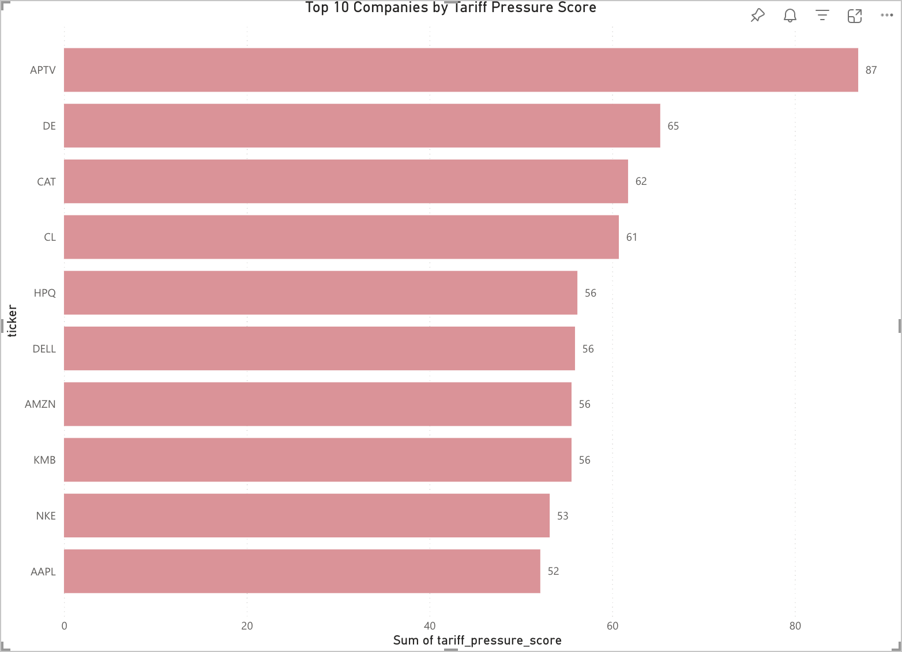
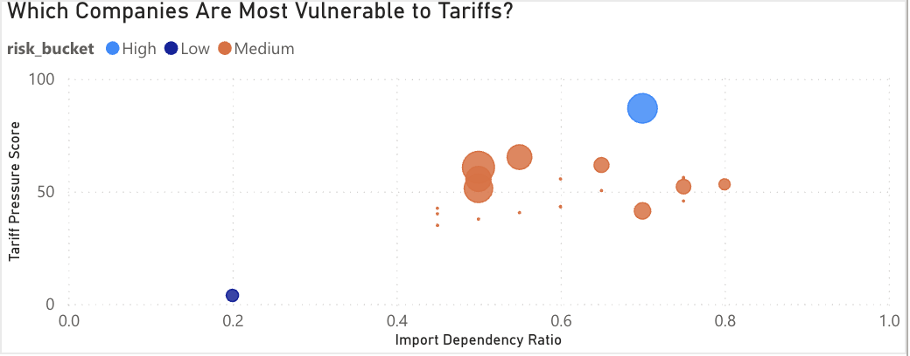
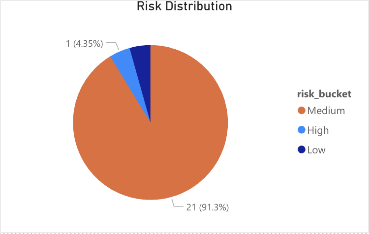
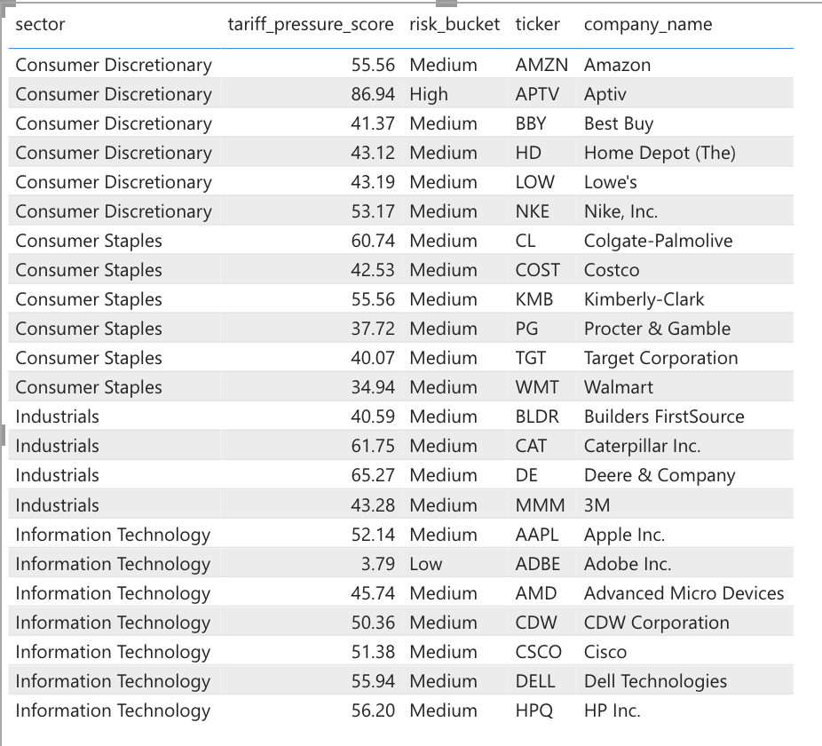

# 📊 Tariff Pressure Index

### *A data-driven view into which companies are most exposed to global trade disruption*

---

## The Question

When tariffs rise, companies don’t all feel it the same way.

Some absorb the shock. Others see margins compress, costs rise, and risk compound.

This project answers a focused question:

> **Which companies are most vulnerable to tariff pressure — and what specifically makes them vulnerable?**

---

## What the Data Reveals

After analyzing trade exposure, geographic revenue distribution, and financial strength across a curated set of companies, clear patterns emerge.

### The Most Exposed Companies

The highest tariff pressure scores are concentrated among a small group:

* **Aptiv (APTV)** — *Score: ~87 (Highest)*
* **Deere (DE)** — *~65*
* **Caterpillar (CAT)** — *~62*
* **Colgate-Palmolive (CL)** — *~61*

These companies consistently rank at the top due to a combination of:

* High **import dependency**
* Meaningful **global revenue exposure**
* Limited financial insulation relative to their exposure

👉 These are companies where tariffs are not just a cost — they are a **structural risk**.

---

### The “Quietly Vulnerable” Majority

One of the most important findings:

> **~91% of companies fall into the *Medium risk* bucket**

This includes companies like:

* Amazon (AMZN)
* Apple (AAPL)
* Nike (NKE)
* Walmart (WMT)
* Costco (COST)

These firms are not immediately high-risk, but they share:

* Moderate to high import dependency (0.5–0.8 range)
* Global revenue exposure
* Sufficient margins to absorb shocks — but not indefinitely

👉 This group represents **latent risk** — stable under normal conditions, but sensitive to sustained trade pressure.

---

### True Resilience Is Rare

Only **one company clearly falls into Low risk**:

* **Adobe (ADBE)** — *Score: ~3.8*

Why?

* Extremely high **gross margin (~89%)**
* Low **import dependency (~0.2)**
* Minimal reliance on physical supply chains

👉 This highlights a key insight:

> **Software-based, asset-light companies are structurally insulated from tariff risk.**

---

## 🔍 What Actually Drives Risk

The scatter plot reveals a strong relationship:

### 1. Import Dependency is the Primary Driver

Companies with import dependency in the **0.6–0.8 range dominate the high-risk zone**

Examples:

* Aptiv (~0.70)
* HP, Dell (~0.75)
* Nike (~0.80)

👉 The more a company depends on global inputs, the more tariffs directly hit its cost structure.

---

### 2. Geographic Exposure Amplifies Risk

Companies with **high international revenue share** see amplified vulnerability:

* Aptiv → ~74% exposure
* Colgate → ~88%
* Cisco → ~68%

👉 Even if production isn’t impacted, **revenue-side exposure introduces risk**.

---

### 3. Margin is the Shock Absorber

Gross margin determines whether a company can survive tariff pressure.

Compare:

* **Adobe (~89%) → Low risk**
* **Aptiv (~6%) → High risk**

👉 Same global economy, completely different outcomes.

---

## The Core Insight

Tariff risk is not about one variable — it’s about **interaction**.

> High import dependency + global revenue exposure + low margins
> = **compounding vulnerability**

This is why companies like Aptiv stand out so sharply — they sit at the intersection of all three.

---

## 📊 Dashboard

👉 https://app.powerbi.com/links/dEwMGO2Lzo?ctid=41f88ecb-ca63-404d-97dd-ab0a169fd138&pbi_source=linkShare&bookmarkGuid=017ffc84-48d3-4ea8-9530-f48a37c4c05a

## Dashboard Preview

### Top 10 Companies by Tariff Pressure Score

### Trade Dependency vs Tariff Risk

### Risk Distribution by Sector

### Full Company Breakdown

The dashboard visualizes:

* Top 10 highest-risk companies
* Distribution of risk across sectors
* Trade dependency vs tariff pressure (bubble view)
* Company-level breakdowns

---

## What This Means in Practice

This analysis suggests:

* Industrial and manufacturing-heavy firms are structurally exposed
* Consumer companies carry moderate but widespread risk
* Software companies remain largely insulated

👉 In a real tariff escalation scenario:

* Risk would **concentrate quickly**, not evenly
* The majority of companies would **degrade gradually**, not collapse immediately

---

## Limitations

* Import dependency is modeled as a proxy
* Geographic revenue extraction depends on filing structure
* Sample size is limited to a focused company universe

---

## Why This Project Matters

This is not just a dashboard.

It demonstrates the ability to:

* Extract insight from **unstructured regulatory data**
* Combine multiple weak signals into a **coherent risk model**
* Translate data into a **clear business narrative**

Because in practice:

> Data isn’t valuable until it explains something real.

---

## Author

Vamika Negi
Computer Science — Arizona State University

---

## Final Takeaway

Tariffs don’t hit the market —
they hit **specific companies in very different ways**.

This project identifies exactly who those companies are — and why.
